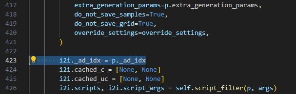

# Wildcards
This extension version is meant to work in pair with this version of [after-detailer](https://github.com/Cryptik-Rick/sd-webui-adetailer) by keeping track of what wildcard has been replaced with, and applying the same wildcard to after detailer's inpainting.

It will work with the base version, but exactly as it would on the base version. This is the first version, and I intend to improve it with a couple quality of life options. See [Upcomming features](#upcomming_features) for more details.

## Features
 * Use `__name__` syntax in your prompt to get a random line from a file named `name.txt` in the wildcards directory.
 * Use `[__name__]` in adetailer's prompt to fill in the wildcard with the same name that was generated for the main prompt.
 * Or use `__name__` in the adetailer's prompt to generate a new random one.

## Install
**Very important:** A line of code needs to be added to the base after-detailer extension in order to keep track of which image we are processing. You can [add the line yourself](#adding-the-line-yourself), or follow the instructions below:

1. If stable-diffusion-webui-wildcards is already installed, make a copy of your wildcards folder, as these will get deleted.
1. Make sure the the following extensions are **uninstalled**: stable-diffusion-webui-wildcards, adetailer, sd-dynamic-prompts. Dynamic-prompts is currently not compatible with the extension. It can still be disabled, though, if you would prefer that. See [uninstalling extensions](#uninstalling-extensions) for more details
1. Open "Extensions" tab.
1. Open "Install from URL" tab in the tab.
1. Enter https://github.com/sdbds/stable-diffusion-webui-wildcards.git to "URL for extension's git repository".
1. Press "Install" button.
1. Wait 5 seconds, and you will see the message "Installed into stable-diffusion-webui\extensions\stable-diffusion-webui-wildcards."
1. Enter https://github.com/Cryptik-Ric/sd-webui-adetailer.git to "URL for extension's git repository".
1. Press "Install" button.
1. Wait 5 seconds again and you will see the message "Installed into stable-diffusion-webui\extensions\sd-webui-adetailer."
1. Go to "Installed" tab, click "Check for updates", and then click "Apply and restart UI". (The next time you can also use this method to update extensions.)
1. Replace the wildcards folder with the backup you made (if applicable)
1. Completely restart A1111 webui including your terminal (black screen that appears when you start automatic 1111).

## Install manually
Alternatively, to install by hand:

1. Make sure the the following extensions are **uninstalled**: stable-diffusion-webui-wildcards, adetailer, sd-dynamic-prompts See [uninstalling extensions](#uninstalling-extensions) for more details
2. From your base `stable-diffusion-webui` directory, run the following commands to install:
    ```
    git clone https://github.com/sdbds/stable-diffusion-webui-wildcards.git extensions/sd-webui-wildcards-ad
    git clone https://github.com/Cryptik-Rick/sd-webui-adetailer.git extensions/sd-webui-adetailer
    ```

Then restart the webui.


## Uninstalling extensions
If you do not know how to uninstall extension, here's a rundown:

1. Stop A1111 webui by closing your terminal (black screen that appears when you start automatic 1111).
1. Navigate to your A1111's install location and then into extensions
1. Manually delete the extension's folders

## Adding the line yourself

On line 423, right below the `i2i = StableDiffusionProcessingImg2Img` class instanciation, add the following line 

```python
i2i._ad_idx = p._ad_idx
```



A PR is in progress on the main extension, so hopefully, installing adetailer from the main branch will be possible.

## Upcomming features
 - [ ] Updating dynamic prompts with the same changes (wildcards would not be useful naymore in that case)
 - [ ] Making a settings menu.
 - [ ] "Replace wildcards" option instead of the inline brackets.
 - [ ] adetailer's PNG info with wildcards replaced (the main one is fine, adetailer's one will still show the one before wildcards).
 - [ ] Support of wildcards in negative prompts (which the base wildcard extension doesn't support right now).
 - [ ] Many improvements on adetailer and wildcards.
